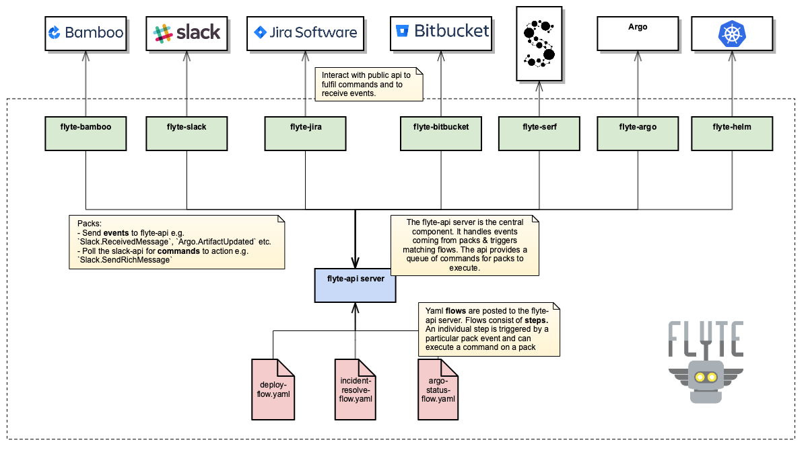
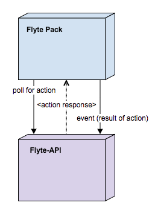

[](https://travis-ci.org/HotelsDotCom/flyte)
[](https://hub.docker.com/r/hotelsdotcom/flyte/)
[](https://hub.docker.com/r/hotelsdotcom/flyte/)


## Overview

Flyte is a platform that allows users to link together disparate parts of their infrastructure and automate tasks.
This is done using 'flows' which essentially take the form of "if this happens in system A, then do this in system B".

For example you could create a flow that triggers sending an email to a team's email if their app's deployment has
failed, or create a whole build pipeline triggered from an instant chat message.

### Architecture

The Flyte-API acts as the orchestrator and is backed by a (MongoDB) database server in which Flows, Pack references and Datastore entries are stored. 

It is anticipated that Flyte will be deployed using some kind of container technology, 
and there is no requirement that Flyte-API and Flyte packs run on the same host. 
Running multiple Flyte-API and/or Flyte pack instances behind load-balancers is recommend to improve resiliency.



>_Component Diagram: Coloured boxes represent applications (which may run in containers)._ 

Flyte is designed to be used across different security zones. 
All that is required is that the packs are able to access the Flyte-API. For example, 
the packs can run in the most secure (e.g. production) environment, monitoring—or even being embedded within—production apps, 
while the Flyte-API runs in a less secure environment, or even the internal network.

 

>_Flyte-API / Flyte Pack interaction: The Flyte Pack queries Flyte-API which returns a response._ 


## Running

The are a number of ways to run flyte-api and its mongo db.
Note that the default mongo host and port for flyte is `localhost:27017` (this value can be changed using the
`FLYTE_MGO_HOST` env variable).


Once running, flyte will be available on http://localhost:8080 (TLS disabled), or http://localhost:8443 (TLS enabled).
The port number can be overridden, see [Port configuration](#port-configuration)  


#### From Source

Pre-req: must have [dep](https://github.com/golang/dep) installed and Go 1.9 or higher.

Build & run:

```
make run
```
 
or manually...
 
```
dep ensure
go test ./... -tags="integration acceptance" //remove tags if only want to run unit tests
docker run -d -p 27017:27017 --name mongo mongo:latest
go build && ./flyte-api
```

#### Using Docker

```
make docker-run
```

or manually...


```
docker run -d -p 27017:27017 --name mongo mongo:latest
docker build -t flyte:latest .
docker run -p 8080:8080 -e FLYTE_MGO_HOST=mongo -d --name flyte --link mongo:mongo flyte:latest
 
```

#### Using Docker-Compose

```
docker-compose build
docker-compose up
```

N.B. to use the mongo-cli on the running mongo container you can use e.g.
 
```
 docker exec -it flyteapi_mongo_1 mongo
```

### Example

using our example set-up will allow you to understand the basics with packs, flows, actions etc. This should be your starting
point for flyte.

[Examples](examples/)

### TLS Mode

TLS is supported by the flyte-api.

To run the flyte-api with TLS mode enabled, filenames of a certificate and matching private key for the server must be 
provided using the environment variables `FLYTE_TLS_CERT_PATH` and `FLYTE_TLS_KEY_PATH`. 

More information regarding the use of TLS in Golang can be found in the [Golang documentation](https://golang.org/pkg/net/http/#ListenAndServeTLS).

### Data TTL

By default the action collection data will expire after a year. To change this, set the following env variable:

- `FLYTE_TTL_IN_SECONDS`

## Authentication and Authorization

Authentication and Authorization is handled using [JWT](https://jwt.io/).
The flyte-api implements OpenID Connect (OIDC), an authentication layer on top of OAuth 2.0, an authorization framework.

More information regarding how the Flyte API and an OIDC provider interact with Users / Flyte Packs can be found [here](docs/readme/AuthenticationAuthorization.md).

To enable auth you must set the following env variables:

- `FLYTE_OIDC_ISSUER_URL` - this is the URL to the OpenID Connect issuer.
- `FLYTE_OIDC_ISSUER_CLIENT_ID` - this is the Client ID of the OpenID Connect issuer.
- `FLYTE_AUTH_POLICY_PATH` - this is a filepath to an auth policy yaml file (see below for details)

#### jwt token

Protected resources are accessed by including a valid JWT bearer token in HTTP requests to the flyte-api.
This token must be issued by the same provider as the referenced OIDC issuer in the flyte-api configuration (`FLYTE_OIDC_ISSUER_URL` & `FLYTE_OIDC_ISSUER_CLIENT_ID`)

#### auth policy yaml 

An example of an auth policy yaml file can be found in [auth/testdata/policy_config.yaml](auth/testdata/policy_config.yaml) 

The file routes incoming requests (based on the path and http method) to a claims based authorisation policy. 
This routing is completely independent of any routing specified in the app. 
The file consists of an array of path policies. Each path policy can contain the following elements:

- `path` specifies a valid [vestigo](https://github.com/husobee/vestigo) path. These can be:
  - static e.g. `/packs` - will only match this exact path 
  - wildcarded e.g. `/packs/*` - will match multiple levels below e.g. /packs/foo, /packs/foo/bar will all match. 
  The wildcard can appear mid url as well, so for example `/packs/*/id` would match /packs/foo/bar/id etc.
  - dynamic/templated e.g. `/packs/:pack` - will match a single level below e.g. /packs/foo-pack. 
  Additionally the template value can be used in the claims (either as a key or value) e.g. claims: { "pack" : ":pack" } 
  would be dynamically resolved to be { "pack" : "foo-pack" } for the above request 
- `method` a list of valid http methods that are used in conjunction with the path to match incoming events. 
If no methods are specified then matching is done purely on the path i.e. all valid http methods are accepted.
- `claims` a map[string][]string of claims that an incoming token must match at least one of to be successfully authenticated. 
If no claims are specified then any request that matches the routing will be allowed through (regardless of whether it contains a valid token or not)  

If the request does not match a path & method in the policy file then 401 unauthorized will be returned.

If the request matches a path & method but does not satisfy the claims then 401 unauthorized will be returned.

If the request matches a path & method and satisfies it's claims then the request will be allowed to continue to the app.

A path policy may be as follows:

```yaml
path: /packs/:pack
methods: [DELETE]
claims:
    groups:
    - admin
    - 1
    pack:
    - :pack
```

This means that a request to e.g. `DELETE /packs/foo-pack` must include a jwt token including claims that satisfy at least one of above claims.
The following types are supported for claims in the token:
 - string
 - bool
 - int
 - []string
 
For example a token containing any of the following claims would succeed (this is not an exhaustive list):

```
- "groups" : "admin"
- "groups" : [..., "admin", ...]
- "groups" : "1"
- "groups" : 1
- "groups" : [..., "1", ...]
- "pack" : "foo-pack"  # the is a dynamic claim where the value of ':pack' in the url ('foo-pack') is then used in the claim
```

### Port configuration

The port number is configurable using the environment variable `FLYTE_PORT`

By default the flyte-api serves on port `8080` (when TLS is disabled) or `8443` (when TLS is enabled, by specifying 
valid `FLYTE_TLS_CERT_PATH` and `FLYTE_TLS_KEY_PATH` environment variables as described above). 


## Logs

 - Log level is set by using `LOGLEVEL` env. variable. Example: `LOGLEVEL=DEBUG|INFO|ERROR|FATAL`
 - Logs can be written to a file instead of std out by setting `LOGFILE` env. variable. Example: `LOGFILE=/tmp/flyte.out`

## Postman

There are a number of postman files in [postman] that can be used to test running flyte-api

## Acceptance Tests

See [README](acceptancetest/README.md).

## Integration Tests

For integration tests:

```bash
go test ./... -tags=integration
```

For the mongo db integration tests, which are slower running:

```bash
go test ./... -tags=db
```

To run both:

```bash
go test ./... -tags="integration db"
```

Please note that both unit and integration tests will run using the above command/s.

## Writing Flows

The main interaction of users with flyte is in writing flows for flyte-api to execute.
 
Flows are a list of steps that define a particular use case - for example triggering the deploy of an app when a user
types the message "deploy foo-app 1.2.0" in a particular chat room.
Each step in a flow consists of an event that triggers it (e.g. an instant message being observed in a particular chat
room); criteria that must be satisfied for the step to run (e.g. the message matches a certain regex); and finally an
action that will be executed off the back of the step (e.g. triggering the deployment system to deploy the requested app).

flyte packs are self-contained apps that are responsible for executing these actions and sending events to the flyte api. 
Packs are domain specific and new ones can be created as and when required. For example the bamboo pack can be used to
trigger bamboo builds and will send events to the flyte api to inform it of build successes, failures etc. Flow writers
can then look out for these events in their flow.

The happy day flow for the above deploy scenario would look to an end user something like this:

1. A user types "add label staging to build 'abc-1.2.0" in the "buildRoom"
1. The app responsible for labeling build (in this case 'Bamboo') is triggered to label the specified app
1. A instant message is sent back to the "deployRoom" chat room notifying the requester that the labeling was successful
  
3 components are in play here: 

 - the "HipChat" pack that:
    1. Will send events to flyte when it observes messages being sent and
    2. Exposes a command that can be called to send a message programmatically
 - the "Bamboo" pack that will expose a command that can be called to trigger labeling of an app and will send an event
 to flyte when this is complete
 - flyte-api itself that will handle the interactions with the packs and execute the deploy flow that the user defines.
  
The above 'deploy' flow would be defined in the flyte-api as follows:

```
{
    "name": "LabelBuildFlow",                               // the name of the flow
    "description": "labels an app based on hipchat msg.",   // optional description
    "labels": {                                             // optional labels to distinguish flows with the same name
            "env": "staging"
    },
    "steps": [
        {                                                   // a flow step
            "id": "hipchat_start_to_bamboo",                // id of the step
            "event": {                                      // if flyte receives an event of this type then it will trigger this step (assuming criteria is met)
                "packName": "HipChat",
                "packLabels": {
                    "env" : "staging"
                },
                "name": "MessageReceived"
            },
            "context": {                                    // extracts details from the event payload and adds to the context - this is availble to refer to in the same step and across steps in a flow
                "label": "{{ Event.Payload.Message|split:' '|index:3 }}",
                "build": "{{ Event.Payload.Message|split:' '|index:6 }}",
                "requestor": "{{ Event.Payload.User }}"
            },
            "criteria": "{{ Event.Payload.RoomId == 'deployRoom' && Event.Payload.Message|match:'^add label$'}}",                                       // the criteria that must be met for this step to execute, i.e. is correct room and message is correct format
            "command": {                                    // calls a command on the 'bamboo' pack to trigger the deploy
                "packName": "Bamboo",
                "name": "AddLabel",
                "input": {
                    "build": "{{ Context.build }}",
                    "label": "{{ Context.label}}"
                }
            }
        },  
        {                                                   // the 2nd of the 2 steps in the flow - this sends a response back to the user that initiated the labeling request
            "id": "bamboo_to_hipchat",
            "dependsOn": [                                
                "hipchat_start_to_bamboo"                   // indicates that step with id "hipchat_start_to_bamboo" must have been previously executed before this step will run
            ],
            "event": {
                "packName": "Bamboo",
                "name": "LabelAdded"
            },
            "command": {
                "packName": "HipChat",
                "packLabels": {
                    "env" : "staging"
                },
                "name": "SendMessage",
                "input": {
                    "roomId": "deployRoom",
                    "message": "Hi {{ Context.requestor }} - labeled {{ Context.build}} build as {{ Context.label }}"
                }
            }
        }
    ]
}
```

This flow consists of 2 steps - one to look out for users typing "add label" messages & to kick off labeling build,
and the 2nd to look out for the successful labeling and to send a success message back to the user.

Steps in the flow have a number of components/features. These are detailed below.

#### Templating

Templates can be used at numerous points to define dynamic values in the flow definition. 
The templates use 'Pongo' which is a Golang implementation of Django templates - for more details about pongo see:
https://github.com/flosch/pongo2.

Note that templates are case sensitive!

Templates can be used in the following places in a flow definition:

1. As values in the 'context' map
1. As values in the event's 'packLabels' map
1. As the 'criteria' value
1. As values in the command's 'packLabels' map
1. As part of the command's 'input'

The template has a few context objects provided to it that you can make use of:

* `Event` - this is the event that triggered the current step. It has the following fields
    * Event.Name - the name of the incoming event e.g. 'BuildSuccess'
    * Event.Payload - the json payload sent by the pack e.g. 'Event.Payload.foo' would return the foo element of the
    event payload
    * Event.Pack.Name - the name of the pack that the event came from e.g. 'Bamboo'
    * Event.Pack.Labels - the map of labels of the pack that the event came from e.g. 'Event.Pack.Labels.env' might
    return for example 'staging'.
    
* `Context` - this is the context that can be used to persist data between flow steps (see below). e.g. 'Context.bar'
would return the 'bar' element stored in the context.

There are a number of custom functions available to use in templates:

*   `randomInt(upperBound)` - creates a random integer in the range [0, upperBound)
*   `randomAlpha(length)` - creates a random string of the specified length containing the characters \[A-Za-z]
*   `base64Encode(string)` - base 64 string encoding
*   `base64Decode(string)` - base 64 string decoding
*   `datastore(key)` - this is a function that extracts values from the flyte datastore - see the section below.
*   `template(template, context)` - this function resolves a pongo template (first argument) using the provided context
    (second argument). The context has to be of type `map[string]interface`

There are a number of custom filters available to use:

*   `kvp` - parses comma separated key=value pairs from a single string piped to the filter into a map\[string]string
*   `key` - retrieves the specified element from a piped in map
*   `index` - retrieves the specified element from a piped in slice
*   `match` - returns a boolean as to whether the piped in data meets the provided regex
*   `matchesCron` - returns a boolean if the piped in data is a time in RFC3339 format which matches the
    [cron expression](https://en.wikipedia.org/wiki/Cron#CRON_expression) argument.

Pongo provides a number of inbuilt filters in addition to these:
https://github.com/flosch/pongo2/blob/master/filters_builtin.go#L3.

For examples please see [template/template_test.go](template/template_test.go)

#### Context

Every flow has a context which is a map of string key/value pairs that is persisted across the flow. 
Users can populate values in the context in one step and refer to them in another. The context therefore builds up
across the steps of a flow as values are added.
For example the useful parts of an event payload in one step can be saved and referred to in a later step.
The context can be thought of as session storage for the lifespan of the flow. 
In the above example the variables 'appName', 'appVersion' and 'requestor' are added to the context in the first step
(when we receive the event from hipchat), which allows us to use them in the 2nd step and send a relevant message back
to the user.
 
The context is the first thing to be evaluated in a step's execution - this means that values from the context can be
used in the event packLabels matching, the criteria 
and command of the very same step. A useful side effect of this is that the expression to extract a value doesn't have
to be repeated multiple times in the same step - the value can be extracted, assigned to a context value, and then the
context value used from thereon out.

#### Criteria

The trigger event payload can be to be interrogated to see if matches a certain criteria. Only if it does will the step
be executed. The criteria should adhere to pongo template language and should evaluate to true or false. 
For more details about pongo see https://github.com/flosch/pongo2. In our example above we check that the hipchat event
originated from the 'deployRoom' and the message body meets a certain regex. 

#### Pack Labels

Pack labels can be used in 2 places in a step - in the incoming event and in the outgoing command. 
In both cases they are used as a filter, allowing a user to be as specific or as general as they want about what packs
can trigger the step and what packs can handle actions from the step.

* For a pack's event to trigger a step then the pack that sent the event must match the packName and include ALL the
packLabels defined in the step's event
* For a pack to pick up and execute a step's command then the pack must match the packName and include ALL the
packLabels defined in the step's command.

To see what pack labels a pack is defined with, then you can look at its pack definition under `/packs/<packId>`
 
For example take a flow with the event definition below that forms part of a step: 

```
"event": {      
             "packName": "Bamboo",
             "packLabels": {
                 "env" : "staging1",
                 "network" : "lab"
             },
             "name": "BuildSuccessful"
},
```

A pack defined with `packName='Bamboo', packLabels={'env' : 'staging1', 'foo' : 'bar', 'network' : 'lab'}` sending
event `BuildSuccessful` would be eligible to trigger the step as it is defined with the same pack name and it includes
all the pack labels in its definition (notice that the pack is defined with more labels - the labels defined in the
flow must just be a subset of the pack's actual labels).

The following packs sending the same event would NOT be able to trigger the step:

`packName='Bamboo', packLabels={'env' : 'staging2', 'network' : 'lab'}` ('env' label's value doesn't match)

`packName='Bamboo', packLabels={'env' : 'staging1', 'x' : 'y'}` (doesn't have 'network' label)

`packName='NotBamboo', packLabels={'env' : 'staging1', 'foo' : 'bar', 'network' : 'lab'}` (packName is wrong)


Labels allow you to be as specific or as general as you want about what instances of a pack handle parts of your
flow - you can apply as many labels as required to target a specific pack instance or set of instances, or leave the
labels off altogether to allow any instance of the pack to handle the work.

The values of pack labels can also be parameterised - this gives a number of benefits, one of which is flow reuse. For
example you might want the same flow in dev as in production but don't want to define the flow multiple times
(with the only difference being the labels to identify the prod or test versions of the required packs).
By parameterising the labels, on your first step you can identify what env the incoming event is from, store this in
the context and then use this value in pack labels (see the postman files for an example of this)

#### dependsOn & Id

There are broadly 2 types of steps in a flow:

1. Those that are 'entry points' to the flow that you want to be triggered by events that originated from outside the
flow. These can be thought of as trigger steps.
2. Those that are mid-flow and internal to the flow that should only be triggered by events that originated from within
the flow.

For example in the above flow the "hipchat_start_to_bamboo" step is the entry point into our flow - we want it be
triggered from any hipchat event that matches the criteria.
Conversely the step "bamboo_to_hipchat" is internal to the flow - we don't want it being triggered by any old
Bamboo.LabelAdded event - we only want it to be triggered if the event is off the back of the Bamboo.AddLabel command we
executed in the first step.

This is where `dependsOn` and `id` come into play. The dependsOn clause marks a step as internal and means that at least
one of the steps listed in the dependsOn must have previously been executed in the flow. 

So in the above example the 2nd step has a dependsOn clause on the first ("hipchat_start_to_bamboo"). This marks the
2nd step as internal and it will only be triggered when:

1. flyte receives an Bamboo.LabelAdded event, **AND**
1. the Bamboo.LabelAdded event is a response to the Bamboo command the flow previously triggered, **AND**
1. the "hipchat_start_to_bamboo" step has previously been triggered

Without a dependsOn clause, a step is a 'trigger step' and can be triggered by any matching event.
Ids just need to be unique within a flow. The dependsOn doesn't have to refer to the immediate previous step - it can be
any set of steps that is a prerequisite for the current step.

#### Command

The command section of a step details what you want to execute if the step is executed. 
The command must be an available command on a pack registered with the flyte-api.

## Datastore

flyte provides a datastore that allows reference data to be persisted and made available for use in flow definitions.
The datastore data is global and items are added by POSTing a multipart request to its resource. The value may be in any
format. You can then select and use datastore data in your flows using the `datastore` function as described previously.

#### Datastore Example

curl: `curl -v -F "key=teams.json" -F "description=hipchat teams.json" -F "value=@teams.json;type=application/json" http://localhost:8080/v1/datastore`

Key in the form field is required and has to be unique. File content type is optional and defaults to
'text/plain; charset=us-ascii'. File key has to be `value`.

`teams` file exmaple:
```
{
    "devinf": {
        "email": "devinf@example.com",
        "hipchat_room": "10000",
        ...
    },
    "devs": {
        "email": "devs@example.com",
        "hipchat_room": "10001",
        ...
    },
    ...
}
```

We can then use this `teams` datastore item in a flow step to lookup the email address for a given team name e.g.

```
   ...
   "command" : {
      "pack-id" : "Hipchat",
      "command-name" : "SendMessage",
      "arguments" : {
         "Message" : "Thanks for contacting us! if you have any further inquires please contact {{ datastore('teams').devinf.email` }}",
         ...
      }
   },
   ...
```

This will work only if the correct content type (`application/json`) is set, otherwise the item's value will be
resolved as a string.

## Flow Executions Audit
Flyte provides easy way to audit flow executions. To search for flow executions use this request
```
/v1/audit/flows
```

This will return latest 50 flow executions. You can filter all flow executions by providing additional request parameters:
- flowName | flow name
- stepId | step id
- actionName | command name
- actionPackName | command pack name
- actionPackLabels | command pack labels as comma delimited string of key value pairs eg. env:staging,foo:bar
- start | start index, could be used for pagination, default is 0
- limit | number of results, default value is 50

You can also view directly individual flow execution if you know id. For example:
```
/v1/audit/flows/5ab24a266f42ed00054733d9
```
