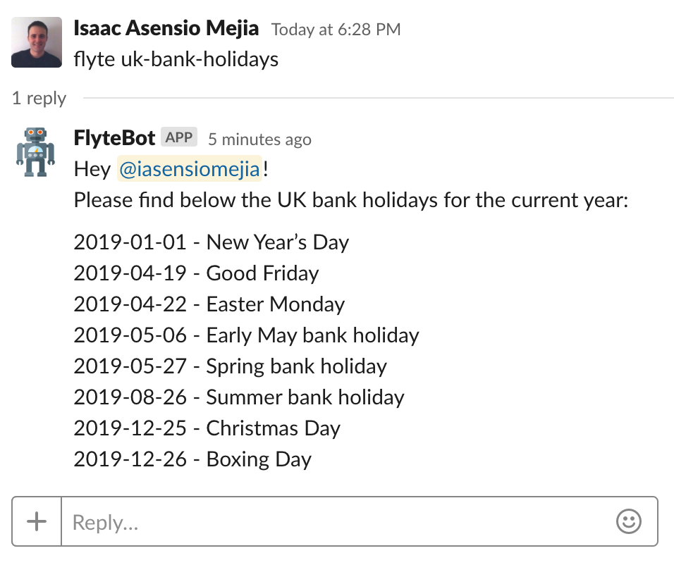

# Quick start

## Writing Flows

The main interaction of users with flyte is in writing flows for flyte to execute.
 
Flows are a list of steps that define a particular use case - for example triggering the deploy of an app when a user types the message "deploy foo-app 1.2.0" in a particular chat room.
Each step in a flow consists of an event that triggers it (e.g. an instant message being observed in a particular chatroom); criteria that must be satisfied for the step to run (e.g. the message matches a certain regex); 
and finally an action that will be executed off the back of the step (e.g. triggering the deployment system to deploy the requested app).

Flyte packs are self-contained apps that are responsible for executing these actions and sending events to the flyte api.
Packs are domain specific and new ones can be created as and when required. For example the bamboo pack can be used to
trigger bamboo builds and will send events to the flyte api to inform it of build successes, failures etc. Flow writers
can then look out for these events in their flow.

In this section we are going to build a simple flow that will return the UK bank holidays for the current year:

1. A user types `flyte uk-bank-holidays` in a Slack channel of your choice. 
1. The pack responsible to get the list of bank holidays is triggered to retrieve that info from an external service.
1. A instant message is sent back to the previous channel notifying the requester about the next UK bank holidays.
  
3 components are in play here: 

 - the "Slack" pack that:
    1. Will send events to flyte when it observes messages being sent and
    2. Exposes a command that can be called to send a message programmatically
 - the "Shell" pack that will expose a command that can be called to run any shell command inside flyte-shell container and will send an event to flyte when this is complete
 - flyte itself that will handle the interactions with the packs and execute the deploy flow that the user defines.
  
## Spin up your local environment

1. Start Mongo db:

        docker run -d --name mongo -p 27017:27017 mongo:latest

1. Start Flyte api:
    
        docker run -d --name flyte --rm -p 8080:8080 -e FLYTE_MGO_HOST=mongo \
               --link mongo:mongo hotelsdotcom/flyte:latest

1. Start [Slack pack](https://github.com/ExpediaGroup/flyte-slack):

        docker run -d --name flyte-slack --rm \
            -e FLYTE_API=http://flyte:8080 \
            -e FLYTE_SLACK_TOKEN=<SLACK-TOKEN> \
            -e FLYTE_SLACK_DEFAULT_JOIN_CHANNEL=<ROOM-ID> \
            --link flyte:flyte hotelsdotcom/flyte-slack:latest

    Replace `<SLACK-TOKEN>` and  `<ROOM-ID>` placeholders with your own values. Slack pack will require them to listen to messages in that channel and reply to them if they match the criteria.
    
1. Start [Shell pack](https://github.com/ExpediaGroup/flyte-shell):

        docker run -d --name flyte-shell --rm \
            -e FLYTE_API_URL=http://flyte:8080 \
            --link flyte:flyte hotelsdotcom/flyte-shell:latest

## Define a flow

Create a `flow.yaml` file with the following content:

```
name: next_uk_bank_holidays
description: prints next UK bank holidays
steps:
- id: receive_uk_bank_holiday_message_send_response
  event:
    packName: Slack
    name: ReceivedMessage
  context:
    Tts: "{{ Event.Payload.threadTimestamp }}{{ Event.Payload.timestamp }}"
    ChannelID: '{{ Event.Payload.channelId }}'
    Requestor: "{{ Event.Payload.user.id }}"
  criteria: "{{ Event.Payload.message|match:'^flyte(\\\\s+)uk-bank-holidays$' }}"
  command:
    packName: Shell
    name: Shell
    input: "curl -s https://www.gov.uk/bank-holidays/england-and-wales.json | jq --arg after $(date +\"%Y\") --raw-output -c '.events[] | select(.date | startswith($after)) | \"\\(.date) - \\(.title)\"'"
- id: send_bank_holiday_response
  event:
    packName: Shell
    name: Output
  dependsOn:
  - receive_uk_bank_holiday_message_send_response
  criteria: "{{ Event.Payload.exit_code|integer == 0 }}"
  command:
    packName: Slack
    name: SendMessage
    input:
      channelId: "{{ Context.ChannelID }}"
      threadTimestamp: "{{ Context.Tts }}"
      message: |-
        Hey <@{{ Context.Requestor }}>!
        Please find below the UK bank holidays for the current year:
        
        {{Event.Payload.stdout}}
```

This flow consists of 2 steps - one to look out for users typing `flyte uk-bank-holidays` messages & to kick off fetching bank holidays data from somewhere,
and the 2nd to look out for the successful retrieving and to send a success message back to the user with the list of bank holidays.


For more information, check [flows](flows.md) page.

## Installing a flow

Now that our flow is ready, we only need to push our flow to Flyte:

    curl -v -X POST http://localhost:8080/v1/flows -H 'content-type: application/x-yaml' -T flow.yaml

## Test your flow

Login to the Slack channel that you configured before, and check that flyte replies to your commands:



Congrats! you built your first flow!

## What’s Next?

- Read [flow page](flows.md) to get more insides about flow creation.  
- Read [datastore page](datastores.md).
- Checkout [pack page](packs.md) if you want to create your own pack.  
