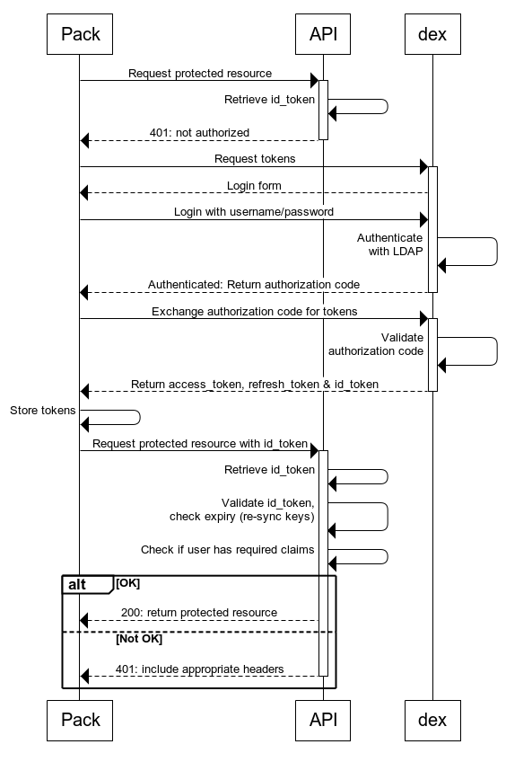
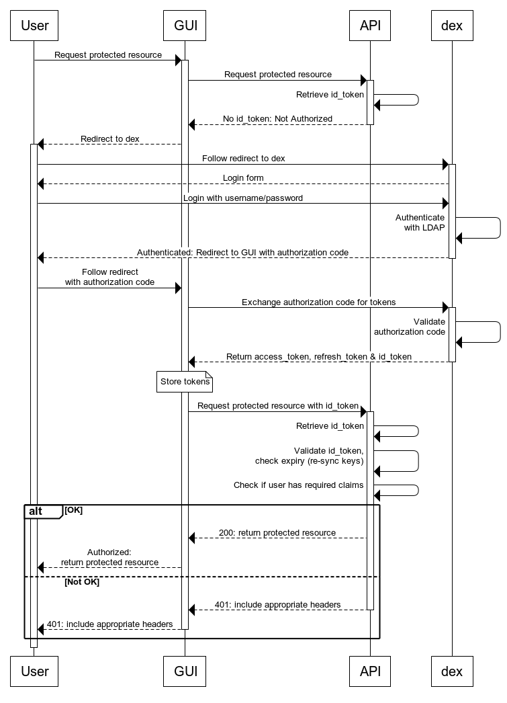

## Interaction between Flyte API, OIDC Provider and User/Flyte Packs
The following information is applicable when Flyte is configured with Authentication/Authorization enabled.

- *User* refers to a human client. For example, a User may send a POST flow request to the Flyte API.
- *Pack* refers to the encompassment of a Flyte Pack and Flyte client.
- *GUI* refers to an application designed for Users to interact with the Flyte API.
- *[dex](https://github.com/coreos/dex)* is used as an example of a OIDC provider.

Requests to the Flyte API from both Users and Flyte Packs should bear a jwt token (if authentication is required the particular resource).
This token should be provided by the OIDC provider beforehand and it is the responsibility of the User / Flyte Pack to obtain the token from the OIDC provider.

During startup, the Flyte API registers the OIDC provider and policy configuration file. From then onwards, the Flyte API authenticates incoming clients by the token that they bare,
and authorizes incoming clients based on the policies defined in the policy configuration file.

>_Sequence Diagram showing the interactions between: Flyte Pack, Flyte API and Dex (an OIDC Provider)_

>_Sequence Diagram showing the interactions between: User, GUI, Flyte API and Dex (an OIDC Provider)_
